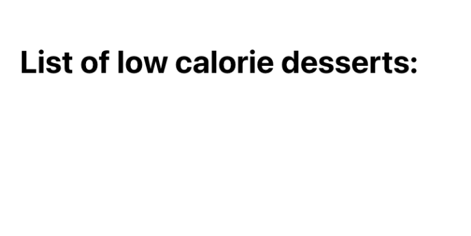

# Instructions

## Task

The Little Lemon restaurant has decided to remove all desserts with high calories from their menu.

In this lab, you are going to implement a new list component, `DessertsList`, that will display a list of desserts with less than 500 calories, all sorted by calories, from low to high.

The data you have to work with has been provided to you inside the App.js file, as an array of objects. Each object represents a dessert and has the following properties: `name`, `calories` and `createdAt`.

The `App` component passes that information to the `DessertsList` component as a prop named `data`.

Each item from the list should display the name of the dessert and the number of calories, both separated by a dash character, i.e. `Chocolate Mousse - 250 cal`.

**Note:** Before you begin, make sure you understand how to work with the Coursera Code Lab for the [Advanced React course](https://www.coursera.org/learn/advanced-react/supplement/htaLX/working-with-labs-in-this-course).

If you run npm start and view the app in the browser, you'll notice that the starting React app works as is. The app outputs the below interface with a simple header. You'll build from that starting point.

## Steps

### **Step 1**

Open the `DessertsList.js` file.

You’ll see an empty component that at the moment returns `null`, resulting in rendering nothing at all.

The `DessertsList` component receives a prop called `data`, which is an array containing the list of desserts.
You can check the exact shape of the data at the top of the `App.js` file, under a variable called `desserts`.

### **Step 2**

Open the `DessertsList.js` file. You only need to implement this component to complete this exercise.

Remove the `null` and instead return a `ul` element that contains a list of `li` elements, where each `li` text is a dessert with the following format: `${dessertName} - ${dessertCalories} cal`.

The list should be sorted by calories in an ascending manner and any desserts with more than 500 calories should be excluded.
For that you have to use a combination of `map`, `filter` and `sort` array operators.

### **Step 3**

Save all the changes and run the app. Preview the updates in the browser, and confirm that the page shows an ul element with just 3 li elements as below:

- Ice Cream - 200 cal
- Tiramisu - 300 cal
- Chocolate Cake - 400 cal

### **Tip**

If you’re having trouble with this lab, please review the `filter` and `sort` methods from arrays in JavaScript.
